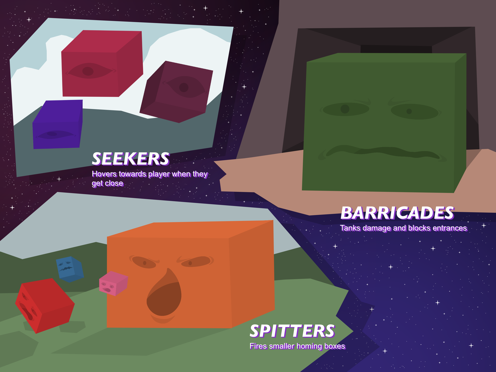

<h1 style="align: center"> Boxman -- Characters</h1>

## Table of Contents
- [Character List](#character-list)
- [Enemies](#enemies)

## Character List
### Boxman

    

...A powerful warrior who travels throughout the galaxy to quell any threat of evil or tyranny. He wields a one of a kind sword called Shape Cleaver. 

**Boxman** is a member of a nearly extinct race. His people fought hard during the emergence of the oversimplifying parasites, but they were unprepared and overwhelmed by the threat that faced them. Through a galactic effort, they were able to quell the threat of the parasites for a time, at the cost of sacrificing most of their people in the process. The remainder of his kind has either gone into hiding, or are currently in cryo sleep until they are needed once more.

### Prophet

    

A very wise polygonal, responsible for giving Boxman his missions and general advice on things.

## Enemies

    

### Seeker
- **_Purpose:_** The main grunts on the battlefield so to speak. They are relatively easy to defeat but may appear in large numbers. They can hover above the ground and track the player regardless of where they go (except through doors or other entrances/exits, e.g. level transitions). 

- **_Functionality:_** They can detect the player’s location and hover towards them. If one comes in contact with the player, it will bounce off and do a small amount of damage. Seekers will bounce off one another, which means two cannot be in the same spot at the same time. 

### Spitter
- **_Purpose:_** Spitters are mostly stationary or slow moving enemies that remain on the ground. They fire simple projectiles that can slightly alter its direction to hit the player (unlike seekers, which fully track the player). 

- **_Functionality:_** Can slowly move or remain stationary. They can only fire in the direction they are facing, which makes their back a good weak point for the player to exploit (the player can draw the spitter towards them then jump behind it to do damage, or rush it and risk being hit by projectiles).

### Barricade
- **_Purpose:_** Completely stationary enemies that mainly serve to block paths or entrances. They are useful to the player as means to defeat them and gain energy/health, or to complete certain puzzles by pushing them around (Barricades specifically for puzzles cannot be destroyed). 

- **_Functionality:_** They cannot move on their own, cannot damage the player directly unless they fall on the player or is launched at them somehow, are an easy enemy to defeat for a boost to energy/health, can be pushed and grabbed by the player to complete certain puzzles/levels.
